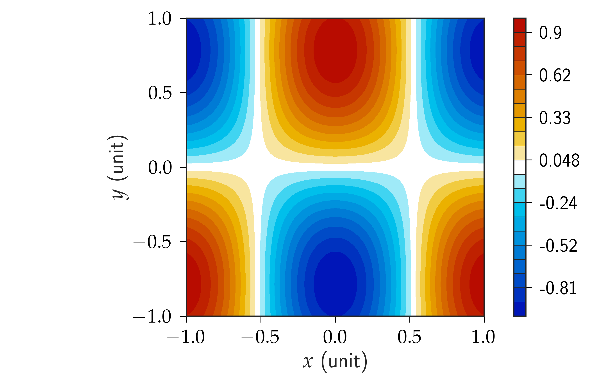
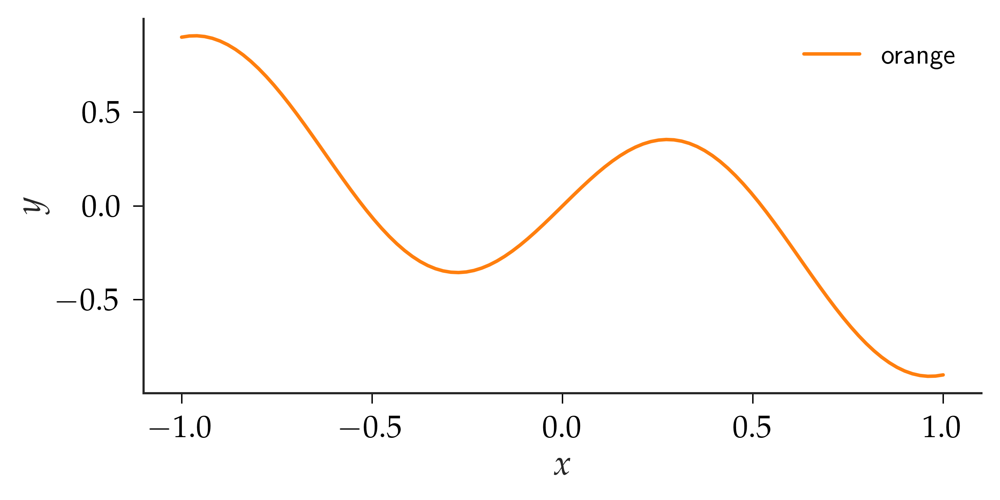
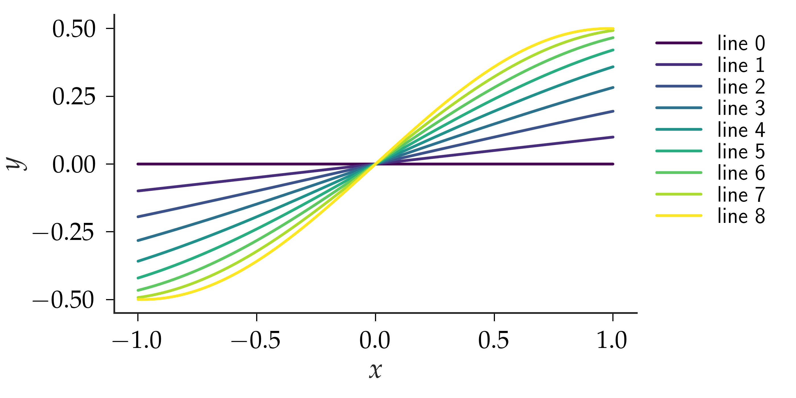

# plotenv

The ultimate matplotlib wrapper. This library simply wrappers matplotlib providing a collection of handy function for publication quality plots. No more messy matplotlib coding and searching stackoverflow to figure out how you got it working last time.

## Installation

Using pip from pypi:

    $ pip install plotenv

or directly from github:

    $ pip install git+git://github.com/lento234/plotenv.git

## Gallery

**Contourf:**

**Single-line plot:**

**Multi-line plot:**

